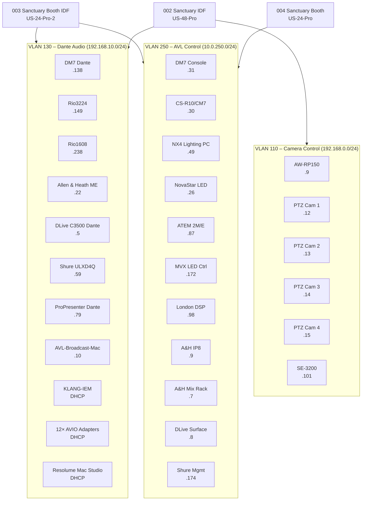

# AVL Network Clients – Main Sanctuary

> **Source:** UniFi Controller MongoDB (direct extraction)  
> **Last Updated:** 2026-05-24

---

## VLAN 130 – Dante Audio Darknet (192.168.10.0/24)

All Dante-networked audio devices. IGMP snooping enabled for multicast management.

| Device | IP | MAC | OUI/Manufacturer | Notes |
|--------|-----|-----|-----------------|-------|
| **Yamaha DM7 Surface** | 192.168.10.138 | ac:44:f2:c9:a9:84 | Yamaha Corporation | Clock master, FOH console |
| **Yamaha Rio3224-D2** | 192.168.10.149 | 00:1d:c1:25:e2:64 | Audinate | Stage box in AVL rack |
| **Yamaha Rio1608-D2** | 192.168.10.238 | 00:1d:c1:28:58:9c | Audinate | Stage box by drums |
| **Allen & Heath ME Option Card** | 192.168.10.22 | 00:1d:c1:21:82:fc | Audinate | ME-1 backup IEM interface |
| **DLive C3500 Dante** | 192.168.10.5 | 00:04:c4:09:0f:68 | Audiotonix | ⚠️ **Relocated to MercyGate League City** — saved fixed address only |
| **Shure ULXD4Q** | 192.168.10.59 | 00:0e:dd:ab:e5:d5 | Shure | Bottom wireless unit |
| **ProPresenter Dante** | 192.168.10.79 | 20:a5:cb:ca:81:6a | Apple | AVLProPrMacMini (Dante NIC) |
| **AVL-Broadcast-Mac** | 192.168.10.10 | 14:98:77:83:07:1d | Apple | LogicPro/Ableton broadcast processing |
| **Resolume Mac Studio** | DHCP | 9c:76:0e:3a:58:5f | Apple | Hostname: ResolumacStudio |
| **Resolume Mac Studio (2nd NIC)** | DHCP | 9c:76:0e:3f:78:db | Apple | Note: "Resolume iMac Studio" |
| **ProPresenter USB-Dante NIC** | DHCP | 0c:37:96:17:bb:08 | Bizlink | USB NIC for Dante audio on ProP |
| **AVIO IEM Adapters (×12+)** | DHCP | 00:1d:c1:54:xx:xx | Audinate | ~14 unnamed Audinate MACs (IEM modules) |
| **KLANG-IEM** | DHCP | 00:04:c4:0f:c6:11 | Audiotonix | Hostname: Klante-0FC611 |

### Audinate (AVIO) MAC Addresses on VLAN 130

These are the unnamed Audinate devices — likely the 12 IEM AVIO-DAO2 adapters plus BCast-Audio:

| MAC | Likely Device |
|-----|--------------|
| 00:1d:c1:55:13:ae | AVIO adapter |
| 00:1d:c1:54:69:92 | AVIO adapter |
| 00:1d:c1:55:13:be | AVIO adapter |
| 00:1d:c1:55:13:b7 | AVIO adapter |
| 00:1d:c1:54:6f:41 | AVIO adapter |
| 00:1d:c1:55:13:b5 | AVIO adapter |
| 00:1d:c1:54:69:f0 | AVIO adapter |
| 00:1d:c1:54:6f:5d | AVIO adapter |
| 00:1d:c1:54:93:92 | AVIO adapter |
| 00:1d:c1:54:93:1f | AVIO adapter |
| 00:1d:c1:54:d4:12 | AVIO adapter |
| 00:1d:c1:23:cd:94 | AVIO adapter |
| 00:1d:c1:54:93:97 | AVIO adapter |
| 00:1d:c1:54:93:17 | AVIO adapter |

---

## VLAN 250 – AVL Darknet (10.0.250.0/24)

Control and management network for AVL devices (non-audio traffic).

| Device | IP | MAC | OUI/Manufacturer | Notes |
|--------|-----|-----|-----------------|-------|
| **Yamaha DM7 Console Net** | 10.0.250.31 | ac:44:f2:c8:59:cc | Yamaha | Console control/management port |
| **Yamaha CS-R10 (CM7) Control Surface** | 10.0.250.30 | ac:44:f2:c8:5a:bf | Yamaha | Add-on control surface to DM7 |
| **NX4 Lighting PC** | 10.0.250.49 | 00:07:32:97:79:7d | AAEON | Hostname: DESKTOP-C1003GU |
| **NovaStar LED Wall Processor** | 10.0.250.26 | 54:b5:6c:0c:1f:b1 | NovaStar | LED wall processing unit |
| **LED WALL ATEM 2M/E** | 10.0.250.87 | 7c:2e:0d:a8:5d:a8 | Blackmagic | Super source to LED wall |
| **MVX LED Wall Controller** | 10.0.250.172 | 18:30:24:00:74:17 | — | LED wall video controller |
| **London DSP Processor** | 10.0.250.98 | 00:0f:d4:03:7c:28 | Soundcraft | BSS London (zone DSP) |
| **Allen & Heath IP8 Remote** | 10.0.250.9 | 00:04:c4:05:e5:f0 | Audiotonix | At mixing console; PoE+ only |
| **Allen & Heath Mix Rack** | 10.0.250.7 | 00:04:c4:06:34:9d | Audiotonix | DLive mix rack |
| **DLive C3500 Surface** | 10.0.250.8 | 00:04:c4:09:0f:68 | Audiotonix | ⚠️ **Relocated to MercyGate League City** — saved fixed address only |
| **Shure Wireless Microphone** | 10.0.250.174 | 00:0e:dd:a5:1e:3b | Shure | Wireless management/WWB |

---

## VLAN 110 – Video Camera Control (192.168.0.0/24)

PTZ camera control network (VISCA/IP, tally).

| Device | IP | MAC | OUI/Manufacturer | Notes |
|--------|-----|-----|-----------------|-------|
| **Panasonic AW-RP150** | 192.168.0.9 | a8:13:74:c5:33:96 | Panasonic | PTZ remote controller |
| **Remote Stream Camera 1** | 192.168.0.12 | a8:13:74:c5:1d:17 | Panasonic | PTZ camera |
| **Remote Stream Camera 2** | 192.168.0.13 | a8:13:74:c5:1d:69 | Panasonic | PTZ camera |
| **Remote Stream Camera 3** | 192.168.0.14 | a8:13:74:c6:55:bd | Panasonic | PTZ camera |
| **Camera 4** | 192.168.0.15 | a8:13:74:c6:55:bb | Panasonic | Remote Cam 4 in booth |
| **DataVideo SE-3200** | 192.168.0.101 | 00:07:36:0a:85:c8 | DataVideo | HD video switcher |

---

## LAN (Native) – AVL Support Devices (10.10.20.0/23)

| Device | IP | MAC | OUI/Manufacturer | Notes |
|--------|-----|-----|-----------------|-------|
| **Blackmagic 40×40 Videohub** | 10.10.20.121 | 7c:2e:0d:07:f7:88 | Blackmagic | SDI routing matrix (Children's / distribution) |
| **Teranex Classroom 1** | 10.10.20.122 | 7c:2e:0d:07:fc:2e | Blackmagic | SDI→Audio de-embed for Classroom 1 |
| **Teranex Classroom 2** | 10.10.20.123 | 7c:2e:0d:18:bb:cb | Blackmagic | SDI→Audio de-embed for Classroom 2 |
| **Teranex Classroom 3** | 10.10.20.124 | 7c:2e:0d:07:fc:14 | Blackmagic | SDI→Audio de-embed for Classroom 3 |
| **Teranex Classroom 4** | 10.10.20.125 | 7c:2e:0d:07:fc:15 | Blackmagic | SDI→Audio de-embed for Classroom 4 |
| **Teranex Classroom 5** | 10.10.20.126 | 7c:2e:0d:17:c7:bc | Blackmagic | SDI→Audio de-embed for Classroom 5 |
| **Teranex Classroom 6** | 10.10.20.127 | 7c:2e:0d:17:c7:d0 | Blackmagic | SDI→Audio de-embed for Classroom 6 |
| **Teranex Worship Center** | 10.10.20.128 | 7c:2e:0d:07:fc:12 | Blackmagic | SDI→Audio de-embed for Worship Sanctuary feed |
| **Teranex DisplayMac 1** | 10.10.21.254 | 7c:2e:0d:08:16:75 | Blackmagic | SDI→Audio de-embed for Mac Mini 1 |
| **Teranex DisplayMac 2** | 10.10.20.13 | 7c:2e:0d:08:16:68 | Blackmagic | SDI→Audio de-embed for Mac Mini 2 |
| **Teranex DisplayMac 4** | 10.10.21.0 | 7c:2e:0d:08:3b:ee | Blackmagic | SDI→Audio de-embed for Mac Mini 4 |
| **AVL BMD Multiview** | 10.10.20.40 | 7c:2e:0d:16:ab:e5 | Blackmagic | Monitoring multiviewer |
| **MG-Cloud-Store** | 10.10.20.7 | 7c:2e:0d:a8:64:28 | Blackmagic | Media Cloud Store 20TB |
| **KLANG Wireless IEM** | 10.10.20.232 | 00:04:c4:31:17:c0 | Audiotonix | KLANG wireless management |
| **MG_Hyperdeck-A** | 10.10.20.13 | 7c:2e:0d:1c:0e:5e | Blackmagic | Podcast streaming HyperDeck |

---

## AVL Wireless Clients (WiFi – No Fixed IP)

| Hostname | MAC | OUI | Purpose |
|----------|-----|-----|---------|
| AVL-iPad-user-07 | a8:5b:78:be:d3:be | Apple | IEM mixing iPad |
| AVL-iPad-user-09 | 5c:f5:da:0a:e0:1c | Apple | IEM mixing iPad |
| MultiTrbackmini | a8:60:b6:11:f1:58 | Apple | MultiTracks Playback iPad Mini |
| MG-MB-AVL-Workroom | 18:81:0e:e7:41:aa | Apple | AVL workroom Mac |
| MGAVLMa46NKF9FC | 00:c5:85:0d:cc:a6 | Apple | AVL Mac (Mac Studio?) |
| MGC-LC-L-AVL-001 | 9c:3e:53:83:8b:a7 | Apple | AVL laptop |
| Display-Mac-3 | a8:60:b6:12:24:03 | Apple | Display/signage Mac |
| Display-Mac-4 | 24:f0:94:f3:b3:fa | Apple | Display/signage Mac |

---

## Network Topology (AVL-focused)

---

## Key Observations

1. **DM7 has two network connections:**
   - Dante (VLAN 130): 192.168.10.138 — for audio transport
   - Console Net (VLAN 250): 10.0.250.31 — for management/control

2. **DLive C3500 shares one MAC for two IPs:**
   - Dante (VLAN 130): 192.168.10.5
   - Surface (VLAN 250): 10.0.250.8
   - Note states: "No DHCP configured due to conflict"

3. **CM7 (CS-R10) is an add-on control surface** to the DM7 at 10.0.250.30

4. **ProPresenter Mac Mini has multiple NICs:**
   - Built-in Ethernet (VLAN 250/LAN)
   - USB Dante NIC (VLAN 130): 192.168.10.79
   - Note: "ProPresenter USB NIC for Dante Audio"

5. **Resolume Mac Studio has multiple NICs:**
   - Two Apple NICs on VLAN 130 (DHCP)
   - Hostname consistently: "ResolumacStudio"

6. **AVL-Broadcast-Mac** (192.168.10.10):
   - Note says "LogicPro Mac processing broadcast audio"
   - This is the Ableton/broadcast processing machine

7. **LED Wall system has 3 controllers:**
   - NovaStar processor (10.0.250.26)
   - ATEM 2M/E for super source (10.0.250.87)
   - MVX controller (10.0.250.172)

8. **London DSP (BSS/Soundcraft)** at 10.0.250.98 — likely handles zone processing (may be the Tesira alternative or complement for hallway zones)

---

## Related Documents

- [UniFi Network Infrastructure](unifi-network.md) — VLANs, switches, port profiles
- [Dante Routing](../../systems/main-sanctuary/audio/dante-routing.md) — Audio subscriptions on VLAN 130
- [Output Zones](../../systems/main-sanctuary/audio/output-zones.md) — Physical signal destinations
