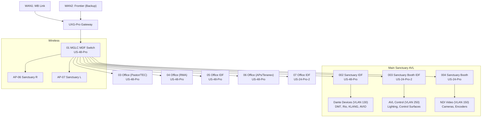

# MercyGate Church – Network Infrastructure

> **Platform:** Ubiquiti UniFi  
> **Controller:** Cloud-hosted (216.189.150.162:8443)  
> **Site Name:** MercyGate Church (`b5idfo62`)  
> **Gateway:** UXG-Pro  
> **Source:** MongoDB direct extraction from UniFi controller  
> **Last Updated:** 2026-05-24

---

## Network Architecture

### WAN Connections

| WAN | Provider | Purpose |
|-----|----------|---------|
| WAN1 | MB Link | Primary internet |
| WAN2 | Frontier | Backup/failover |

### VLANs

| VLAN | Name | Subnet | DHCP | Domain | IGMP | Purpose |
|------|------|--------|------|--------|------|---------|
| — (native) | 00 - LAN (White) | 10.10.20.0/23 | ✅ | mercygatechurch.com | ✅ | General LAN, default |
| 11 | 11 - Management | 10.10.11.0/24 | ✅ | — | ✅ | Network device management |
| 12 | Camera Secondary | 192.168.12.0/24 | ✅ | — | ❌ | Secondary camera network |
| 20 | 20 - VoIP (Avaya) (Orange) | 10.0.20.0/24 | ✅ | voip.mercygate.work | ✅ | Phone system |
| 100 | 100 - Security Control Access | 10.0.100.0/24 | ✅ | mercygate.work | ✅ | Access control panels |
| 110 | 110 - Video Camera Control | 192.168.0.0/24 | ✅ | — | ✅ | PTZ camera control (VISCA, etc.) |
| 120 | 120 - Security Camera | 192.168.3.0/24 | ❌ | mercygate.work | ❌ | Security cameras (static IP) |
| **130** | **130 - Dante Audio Darknet** | **192.168.10.0/24** | ✅ | dante.mercygate.work | ✅ | **Dante audio network** |
| **150** | **150 - NDI Network** | 192.172.150.0/24 | ✅ | — | ✅ | **NDI video transport** |
| 170 | 170 - MG Checkin | 172.16.170.0/24 | ✅ | — | ✅ | Check-in kiosks |
| **250** | **250 - AVL Darknet** | **10.0.250.0/24** | ✅ | audio.mercygate.work | ✅ | **AVL control/management** |
| 1000 | 1000 - Public Guest WiFi (Blue) | 10.172.0.0/22 | ✅ | localdomain | ❌ | Guest internet access |
| 1500 | 1500 - HONEYPOT Public Access | 192.172.24.0/24 | ✅ | — | ❌ | Honeypot/monitoring |
| VPN | Remote Management VPN | 192.1.172.0/28 | — | — | — | Remote admin access |

### AVL-Critical VLANs

| VLAN | Subnet | Purpose | Key Devices |
|------|--------|---------|-------------|
| **130** | 192.168.10.0/24 | Dante Audio | DM7, Rio3224, Rio1608, KLANG, AVIO adapters, Allen & Heath |
| **150** | 192.172.150.0/24 | NDI Video | NDI cameras/sources, video transport |
| **250** | 10.0.250.0/24 | AVL Control | Console control, lighting network, management |
| **110** | 192.168.0.0/24 | Camera Control | PTZ control, camera tally |

---

## Network Devices

### Gateway

| Device | Model | IP | Firmware | Purpose |
|--------|-------|-----|----------|---------|
| 00 MercyGate UXG Gateway | UXG-Pro | 72.22.198.138 (WAN) | 5.0.12 | Edge router/firewall |

### Switches

| Device | Model | IP | Location | Purpose |
|--------|-------|-----|----------|---------|
| 01 MGLC MDF Switch | US-48-Pro | 10.10.20.96 | MDF closet | Core distribution |
| **002 Sanctuary IDF Switch** | US-48-Pro | 10.10.20.23 | Sanctuary | **Stage/audio infrastructure** |
| **003 Sanctuary Booth IDF Switch** | US-24-Pro-2 | 10.10.20.97 | AVL Booth | **FOH/broadcast** |
| **004 Sanctuary Booth** | US-24-Pro | 10.10.21.103 | AVL Booth | **AVL secondary** |
| 03 Office IDF Switch (Pastor, TEC) | US-48-Pro | 10.10.21.110 | Office wing | Office network |
| 04 Office IDF Switch (Office RMA) | US-48-Pro | 10.10.21.29 | Office wing | Office network |
| 05 Office IDF Switch | US-48-Pro | 10.10.20.119 | Office wing | Office network |
| 06 Office IDF Switch (APs, Teranex) | US-48-Pro | 10.10.20.78 | Office wing | **APs + Teranex Minis** |
| 07 Office IDF Switch | US-24-Pro-2 | 10.10.20.158 | Office wing | Office network |
| 08 Office Printer Switch Flex | USW-Flex-5 | 10.10.20.46 | Office | Printer switch |
| (unnamed) | USW-Lite-8-A | 10.10.20.238 | — | Small switch |

### Access Points

| Device | Model | IP | Location |
|--------|-------|-----|----------|
| MG-AP-01 Office | U6-Mesh-Pro | 10.10.20.69 | Office |
| MG-AP-02 Event Center | U6-Mesh-Pro | 10.10.21.170 | Event Center |
| MG-AP-03 Youth Room | U6-Mesh-Pro | 10.10.20.163 | Youth |
| MG-AP-04 Check-IN | U6-Mesh-Pro | 10.10.21.160 | Lobby |
| MG-AP-05 MGLC | U6-Mesh-Pro | 10.10.21.123 | Main building |
| **MG-AP-06 Sanctuary R** | U6-Mesh-Pro | 10.10.21.169 | Sanctuary (right) |
| **MG-AP-07 Sanctuary L** | U6-Mesh-Pro | 10.10.20.134 | Sanctuary (left) |
| Baby Check-in AP10 | UAP-AC-Pro | 10.10.21.81 | Kids wing |

---

## WiFi Networks (SSIDs)

| SSID | Security | VLAN | Purpose |
|------|----------|------|---------|
| MercyGate | WPA2-PSK | LAN (native) | Staff/internal |
| Welcome to MercyGate | Open | Guest (1000) | Public guest WiFi |
| MG_IoT | WPA2-PSK | LAN (native) | IoT devices |
| element-2e63dccae5e4cbdd | WPA2-PSK | LAN (native) | IoT/device pairing |

---

## Port Profiles

| Profile | Native VLAN | Tagged VLANs | PoE | Use Case |
|---------|-------------|--------------|-----|----------|
| LAN with VoIP | LAN | — | Auto | Office drops with phone |
| Access Point Profile | LAN | — | Auto | AP uplinks |
| **MG Dante Audio** | **VLAN 130** | — | Auto | **Dante devices** |
| **MG AVL Darknet** | **VLAN 250** | — | Auto | **AVL control devices** |
| **MG NDI network** | **VLAN 150** | — | Auto | **NDI video devices** |
| Streaming Network | Streaming | — | Auto | Encoder/streaming |
| MG Checkin Ports | VLAN 170 | — | Auto | Check-in kiosks |
| Trunk Port | LAN | (all tagged) | Auto | Inter-switch uplinks |
| Publicly Available Ports | Honeypot (1500) | — | Auto | Monitored access |

---

## Dante Network (VLAN 130) Integration

The Dante Audio Darknet (VLAN 130, 192.168.10.0/24) is the dedicated isolated network for all Dante audio traffic:

| Device | IP (from Dante docs) | Switch Port Profile |
|--------|---------------------|-------------------|
| DM7 (Clock Master) | 192.168.10.1 | MG Dante Audio |
| Rio3224-D2 | 192.168.10.x | MG Dante Audio |
| Rio1608-D2 | 192.168.10.x | MG Dante Audio |
| KLANG-IEM | 192.168.10.x | MG Dante Audio |
| BCast-Audio (AVIO) | 192.168.10.x | MG Dante Audio |
| Allen & Heath | 192.168.10.22 | MG Dante Audio |
| MG-AVL-Ableton | 192.168.10.x | MG Dante Audio |
| Resolume-Mac-Studio | 192.168.10.x | MG Dante Audio |
| ProPresenter-MacMini | 192.168.10.x | MG Dante Audio |
| IEM AVIO adapters (×12) | 192.168.10.x | MG Dante Audio |
| ULXD4Q wireless (×4) | 192.168.10.x | MG Dante Audio |

> **IGMP Snooping:** Enabled — critical for Dante multicast traffic management  
> **DHCP:** Enabled (most Dante devices use static, but DHCP available as fallback)

---

## Mermaid Topology

---

## Related Documents

- [Dante Routing](../systems/main-sanctuary/audio/dante-routing.md) — VLAN 130 device subscriptions
- [Output Zones](../systems/main-sanctuary/audio/output-zones.md) — Signal flow to rooms
- [Dante Full Topology](../diagrams/mermaid/dante-full-topology.md) — Audio network diagram
