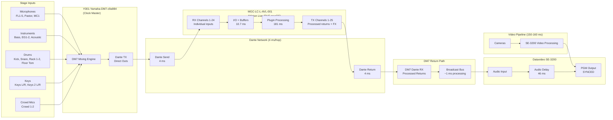
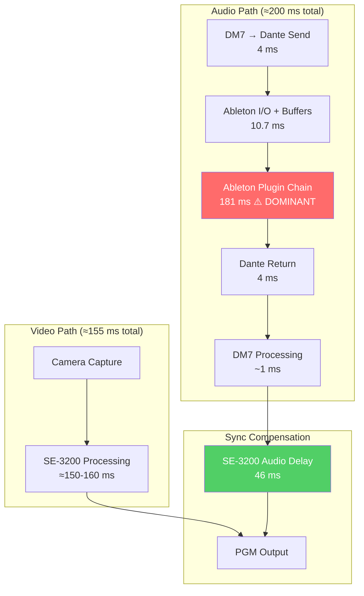
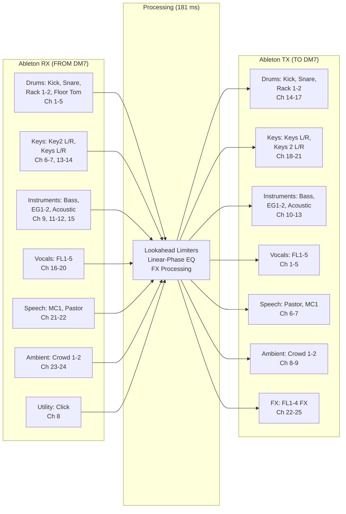
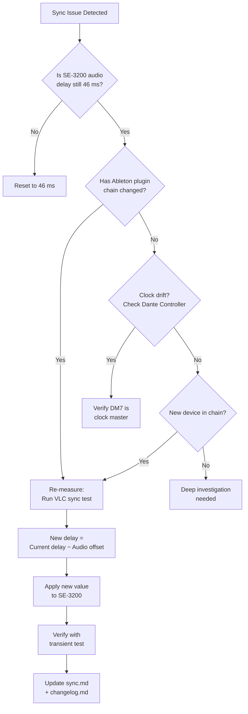

# Broadcast Audio Signal Flow – Main Sanctuary

## Full Broadcast Audio Path (DM7 → Ableton → DM7 → SE-3200)

## Latency Breakdown Diagram

## Ableton Channel Flow (Detail)

## Sync Decision Diagram

## Notes

- Render these diagrams on GitHub (native Mermaid support) or with any Mermaid-compatible viewer
- The broadcast audio path is the longest-latency audio chain due to the 181 ms plugin processing
- All timing values are measured, not estimated (see [Broadcast Sync](../../systems/main-sanctuary/broadcast/sync.md))
