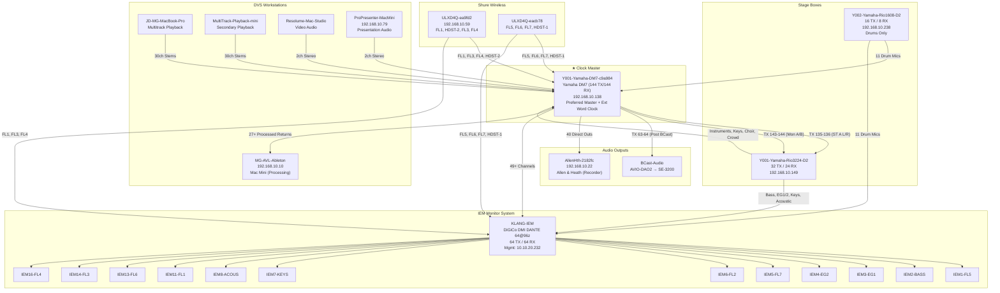
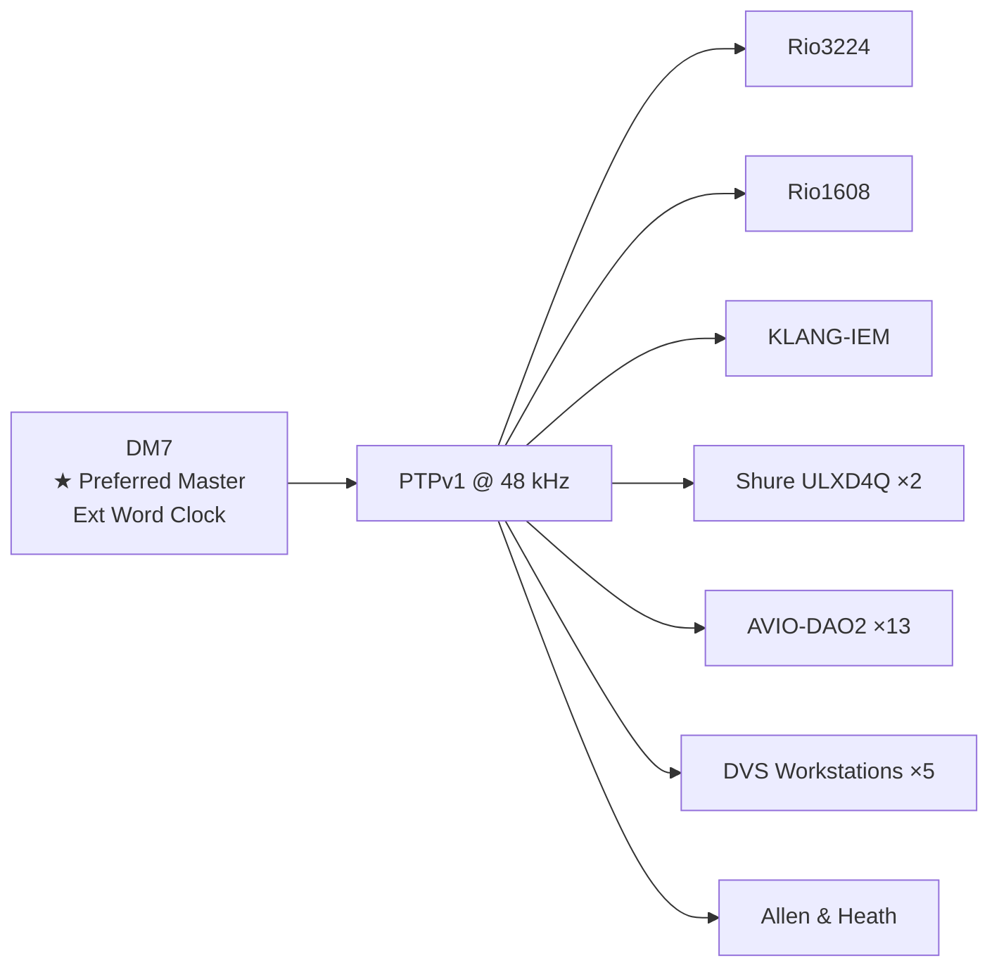
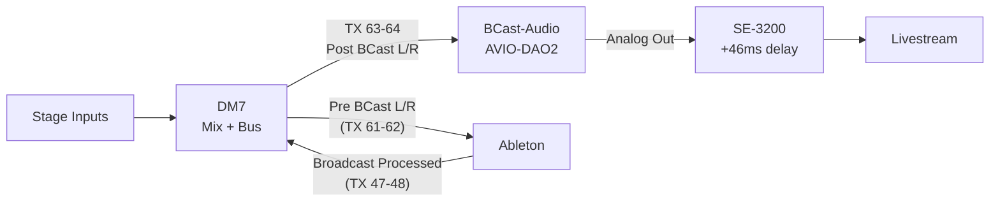
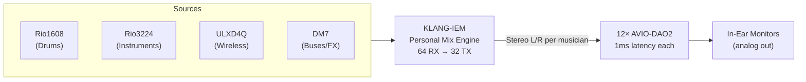

# Dante Full Topology – Main Sanctuary

> Generated from `Dante-config-20260524.xml`

## Complete Signal Flow

```mermaid
flowchart TD
	subgraph ClockMaster["★ Clock Master"]
		DM7["Y001-Yamaha-DM7-c9a984<br/>Yamaha DM7 (144 TX/144 RX)<br/>192.168.10.138<br/>Preferred Master + Ext Word Clock"]
	end

	subgraph StageBoxes["Stage Boxes"]
		RIO32["Y001-Yamaha-Rio3224-D2<br/>32 TX / 24 RX<br/>192.168.10.149"]
		RIO16["Y002-Yamaha-Rio1608-D2<br/>16 TX / 8 RX<br/>192.168.10.238<br/>Drums Only"]
	end

	subgraph MonitorSystem["IEM Monitor System"]
		KLANG["KLANG-IEM<br/>DiGiCo DMI DANTE 64@96z<br/>64 TX / 64 RX<br/>Mgmt: 10.10.20.232"]
		IEM1["IEM1-FL5"]
		IEM2["IEM2-BASS"]
		IEM3["IEM3-EG1"]
		IEM4["IEM4-EG2"]
		IEM5["IEM5-FL7"]
		IEM6["IEM6-FL2"]
		IEM7["IEM7-KEYS"]
		IEM8["IEM8-ACOUS"]
		IEM11["IEM11-FL1"]
		IEM13["IEM13-FL6"]
		IEM14["IEM14-FL3"]
		IEM16["IEM16-FL4"]
	end

	subgraph Wireless["Shure Wireless"]
		ULXD1["ULXD4Q-ea9fd2<br/>192.168.10.59<br/>FL1, HDST-2, FL3, FL4"]
		ULXD2["ULXD4Q-eacb78<br/>FL5, FL6, FL7, HDST-1"]
	end

	subgraph Workstations["DVS Workstations"]
		ABL["MG-AVL-Ableton<br/>192.168.10.10<br/>Mac Mini (Processing)"]
		JD["JD-MG-MacBook-Pro<br/>Multitrack Playback"]
		MT["MultiTrack-Playback-mini<br/>Secondary Playback"]
		RES["Resolume-Mac-Studio<br/>Video Audio"]
		PP["ProPresenter-MacMini<br/>192.168.10.79<br/>Presentation Audio"]
	end

	subgraph Outputs["Audio Outputs"]
		BCAST["BCast-Audio<br/>AVIO-DAO2 → SE-3200"]
		AH["AllenHth-2182fc<br/>192.168.10.22<br/>Allen & Heath (Recorder)"]
	end

	%% Stage inputs to DM7 and KLANG
	RIO32 -->|"Instruments, Keys, Choir, Crowd"| DM7
	RIO32 -->|"Bass, EG1/2, Keys, Acoustic"| KLANG
	RIO16 -->|"11 Drum Mics"| DM7
	RIO16 -->|"11 Drum Mics"| KLANG

	%% Wireless to DM7 and KLANG
	ULXD1 -->|"FL1, FL3, FL4, HDST-2"| DM7
	ULXD1 -->|"FL1, FL3, FL4"| KLANG
	ULXD2 -->|"FL5, FL6, FL7, HDST-1"| DM7
	ULXD2 -->|"FL5, FL6, FL7, HDST-1"| KLANG

	%% DM7 outputs
	DM7 -->|"TX 135-136 (ST A L/R)"| RIO32
	DM7 -->|"TX 143-144 (Mon A/B)"| RIO32
	DM7 -->|"TX 63-64 (Post BCast)"| BCAST
	DM7 -->|"40 Direct Outs"| AH
	DM7 -->|"49+ Channels"| KLANG

	%% Processing loop
	DM7 <-->|"27+ Processed Returns"| ABL

	%% Playback to DM7
	JD -->|"30ch Stems"| DM7
	MT -->|"30ch Stems"| DM7
	RES -->|"2ch Stereo"| DM7
	PP -->|"2ch Stereo"| DM7

	%% KLANG to IEMs
	KLANG --> IEM1
	KLANG --> IEM2
	KLANG --> IEM3
	KLANG --> IEM4
	KLANG --> IEM5
	KLANG --> IEM6
	KLANG --> IEM7
	KLANG --> IEM8
	KLANG --> IEM11
	KLANG --> IEM13
	KLANG --> IEM14
	KLANG --> IEM16
```

## Clock Distribution

```mermaid
flowchart LR
	DM7["DM7<br/>★ Preferred Master<br/>Ext Word Clock"] --> PTP["PTPv1 @ 48 kHz"]
	PTP --> RIO32["Rio3224"]
	PTP --> RIO16["Rio1608"]
	PTP --> KLANG["KLANG-IEM"]
	PTP --> ULXD["Shure ULXD4Q ×2"]
	PTP --> AVIO["AVIO-DAO2 ×13"]
	PTP --> DVS["DVS Workstations ×5"]
	PTP --> AH["Allen & Heath"]
```

## Broadcast Audio Path

```mermaid
flowchart LR
	Sources["Stage Inputs"] --> DM7["DM7<br/>Mix + Bus"]
	DM7 -->|"TX 63-64<br/>Post BCast L/R"| BCAST["BCast-Audio<br/>AVIO-DAO2"]
	BCAST -->|"Analog Out"| SE3200["SE-3200<br/>+46ms delay"]
	SE3200 --> Stream["Livestream"]

	DM7 -->|"Pre BCast L/R<br/>(TX 61-62)"| ABL["Ableton"]
	ABL -->|"Broadcast Processed<br/>(TX 47-48)"| DM7
```

## IEM Signal Chain

```mermaid
flowchart LR
	subgraph Sources
		RIO16["Rio1608<br/>(Drums)"]
		RIO32["Rio3224<br/>(Instruments)"]
		ULXD["ULXD4Q<br/>(Wireless)"]
		DM7["DM7<br/>(Buses/FX)"]
	end

	Sources --> KLANG["KLANG-IEM<br/>Personal Mix Engine<br/>64 RX → 32 TX"]

	KLANG -->|"Stereo L/R per musician"| AVIO["12× AVIO-DAO2<br/>1ms latency each"]
	AVIO --> IEM["In-Ear Monitors<br/>(analog out)"]
```
