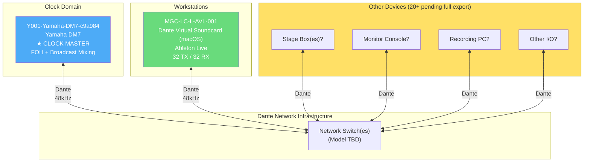
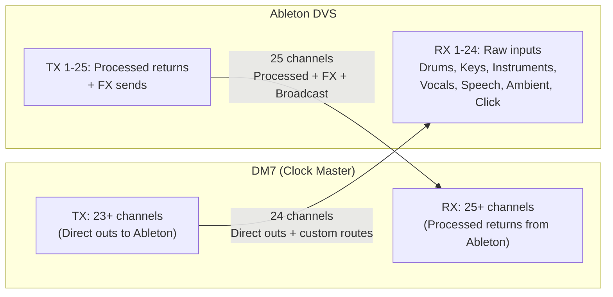
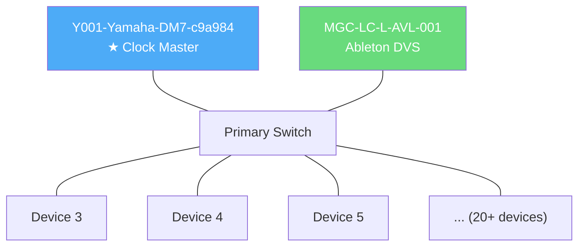

# Dante Network Topology – Main Sanctuary

## Device Topology (Known Devices)

## Audio Flow Between Known Devices

## Full Network Topology (To Be Completed)

> This diagram will be expanded when the full Dante Controller export (with all 20+ devices and subscriptions) is provided.

## Notes

- DM7 is the preferred clock master for the entire network
- All devices operate at 48 kHz
- Default Dante latency: 4 ms per network hop
- Full topology will be documented once complete preset export is available
