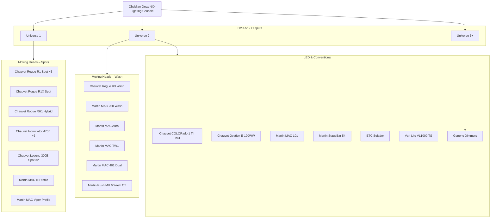
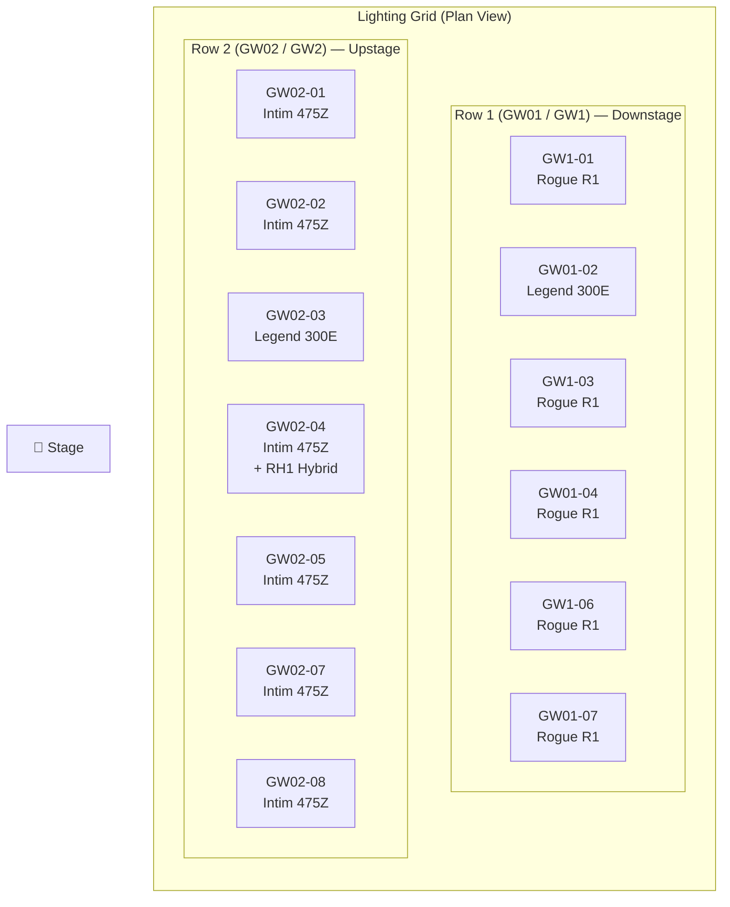
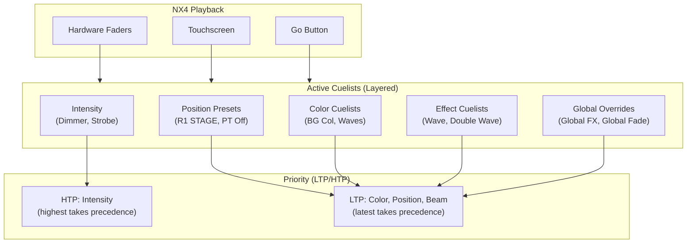

# Lighting System Topology – Main Sanctuary

---

## Signal Flow

---

## Fixture Position Layout

---

## Cuelist Signal Flow

---

## Related Documents

- [Dante Full Topology](dante-full-topology.md) — Audio network diagram
- [Broadcast Audio Flow](broadcast-audio-flow.md) — Audio signal chain
