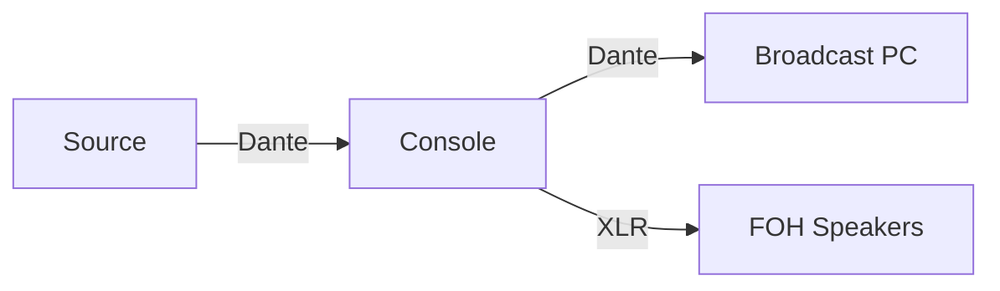

# Signal Flow Symbols

## Purpose

Standard symbols for signal flow diagrams to ensure consistency across all documentation.

## Connection Types

| Symbol | Meaning |
|--------|---------|
| ──── | Analog audio (XLR, TRS) |
| ═══ | Digital audio (Dante, AES) |
| ─ ─ ─ | Network/IP |
| ●───● | SDI video |
| ○───○ | HDMI video |
| ◆───◆ | DMX lighting |

## Device Symbols

| Symbol | Meaning |
|--------|---------|
| [BOX] | Processing device |
| (CIRCLE) | Source/destination |
| <DIAMOND> | Decision/split point |
| {CLOUD} | Network switch/infrastructure |

## Direction

- Left to right = signal flow direction
- Top to bottom = priority (most critical on top)

## Mermaid Diagram Conventions

## Labels

- Always label connection type (Dante, SDI, HDMI, etc.)
- Include channel numbers where relevant
- Note clock source with ★ symbol
