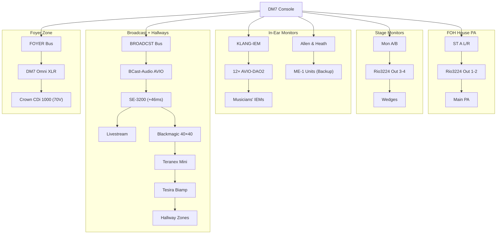

# Main Sanctuary – Output Zones & Signal Flow

> **Source:** DM7 Editor AppData + Dante Controller export + user clarifications  
> **Last Updated:** 2026-05-24

---

## System Overview

```
┌─────────────────────────────────────────────────────────────────────┐
│                        YAMAHA DM7 CONSOLE                           │
│                    (Clock Master · FOH · Broadcast)                  │
├─────────────────────────────────────────────────────────────────────┤
│                                                                     │
│  OUTPUTS:                                                           │
│  ├── ST A L/R ──────── Rio3224 RX 1-2 ──── FOH PA (House)         │
│  ├── Mon A/B ──────── Rio3224 RX 3-4 ──── Stage Wedges            │
│  ├── BROADCST L/R ──── BCast-Audio AVIO ── SE-3200 (+46ms) ── LSS │
│  ├── FOYER ─────────── Omni XLR Out ───── Crown CDi 1000 (70V)    │
│  ├── SptfyOnl L/R ──── (patches to Foyer/BCast in preservice)     │
│  ├── STAGEMON ──────── Rio3224 RX ──────── Stage monitors          │
│  ├── Mon A/B Stage ─── Rio3224 RX 3-4 ──── Stage monitor wedges   │
│  ├── REFMONL/R ─────── (Reference monitors at FOH position)       │
│  ├── ProP SPK ──────── (ProPresenter confidence speaker)           │
│  ├── IEM System ────── KLANG-IEM ──────── 12× AVIO-DAO2 ── IEMs  │
│  ├── Allen & Heath ──── ME-1 Backup IEM system                     │
│  └── Cam10Mic In ────── SE-3200 Audio Out 1 ── Omni In            │
│                                                                     │
└─────────────────────────────────────────────────────────────────────┘
```

---

## Zone 1: FOH (Front of House) Main PA

| Parameter | Value |
|-----------|-------|
| **Console Bus** | ST A (Stereo A Left/Right) |
| **DM7 Channel** | 160–161 (Purple) |
| **Dante TX** | DM7 TX 135 (ST A L), TX 136 (ST A R) |
| **Dante RX** | Rio3224 RX 1, RX 2 |
| **Physical Output** | Rio3224-D2 analog outputs 1–2 → Main PA amplifiers |
| **Signal** | Full FOH mix — all sources summed via channel faders |

---

## Zone 2: Stage Monitors

### Monitor A & B (Wedges)

| Parameter | Value |
|-----------|-------|
| **Console Bus** | Mon A, Mon B (Matrix buses) |
| **DM7 Channel** | 156 (Mon A), 157 (Mon B) — Orange |
| **Dante TX** | DM7 TX 143 (Mon A Stage), TX 144 (Mon B Stage) |
| **Dante RX** | Rio3224 RX 3, RX 4 |
| **Physical Output** | Rio3224-D2 analog outputs 3–4 → Stage monitor wedges |
| **Purpose** | For musicians without IEMs or as backup floor monitors |

### STAGEMON Bus

| Parameter | Value |
|-----------|-------|
| **Console Bus** | STAGEMON (Mix bus) |
| **DM7 Channel** | 152 — Orange |
| **Physical Output** | Rio3224 RX → stage area |
| **Purpose** | Separate stage monitor mix (potentially drum fill or side fill) |

---

## Zone 3: In-Ear Monitors (IEM System)

### Primary: KLANG over Dante

| Parameter | Value |
|-----------|-------|
| **Processor** | KLANG-IEM (DiGiCo DMI DANTE 64@96z) |
| **Input Sources** | 56 channels from DM7, Rio3224, Rio1608, ULXD4Q wireless |
| **Output** | 32 TX channels → 12 AVIO-DAO2 adapters (stereo pairs) |
| **Latency** | 1 ms per AVIO adapter |
| **Capacity** | 16 personal mixes (12 active musicians) |

| IEM Adapter | Musician | KLANG TX |
|-------------|----------|----------|
| IEM1-FL5 | Front Line 5 | 9–10 |
| IEM2-BASS | Bass | 3–4 |
| IEM3-EG1 | Electric Guitar 1 | 5–6 |
| IEM4-EG2 | Electric Guitar 2 | 7–8 |
| IEM5-FL7 | Front Line 7 | 19–20 |
| IEM6-FL2 | Front Line 2 | 11–12 |
| IEM7-KEYS | Keys | 13–14 |
| IEM8-ACOUS | Acoustic | 15–16 |
| IEM11-FL1 | Front Line 1 | 21–22 |
| IEM13-FL6 | Front Line 6 | 17–18 |
| IEM14-FL3 | Front Line 3 | 27–28 |
| IEM16-FL4 | Front Line 4 | 31–32 |

### Backup: Allen & Heath ME-1 System

| Parameter | Value |
|-----------|-------|
| **Interface** | AllenHth-2182fc (Brooklyn II Dante card, 64 RX) |
| **Receives** | 40 channels from DM7 direct outs |
| **Purpose** | Backup IEM system if KLANG fails; overflow for >16 musicians |
| **Personal Mixers** | Allen & Heath ME-1 units (distributed via Cat5) |
| **IP** | 192.168.10.22 (static), VLAN 2 |

### DM7 IEM Support Buses

| DM7 Ch | Name | Purpose |
|--------|------|---------|
| 129–130 | Track IE L/R | Tracks IEM feed |
| 131–132 | IEM 4 L/R | Spare IEM mix 4 |
| 133 | CHOIRMON | Choir monitor mix |
| 135–136 | Inst Bus L/R | Instrument bus (to KLANG RX 55-56) |

---

## Zone 4: Broadcast (Livestream)

### Signal Path

```
DM7 BROADCST Bus (Ch 150-151)
	│
	├── DM7 TX 63 "Post BCast L"
	├── DM7 TX 64 "Post BCast R"
	│
	▼
BCast-Audio (AVIO-DAO2)
	│ Analog XLR output
	▼
Datavideo SE-3200 Video Switcher
	│ +46 ms audio delay applied here
	│ Audio embedded into program output
	▼
SDI Program Output → Livestream Encoder
	│
	├── Also: SDI → Blackmagic 40×40 (Input 13)
	│         → Teranex Minis (SDI→XLR de-embed)
	│         → Tesira Biamp → Hallway Zones
	│
	└── Livestream (YouTube/Facebook/etc.)
```

| Parameter | Value |
|-----------|-------|
| **Console Bus** | BROADCST (Matrix bus, stereo) |
| **DM7 Channel** | 150–151 (Orange) |
| **Dante TX** | DM7 TX 63 (Post BCast L), TX 64 (Post BCast R) |
| **Dante RX** | BCast-Audio RX 1–2 |
| **AVIO Output** | Analog XLR → SE-3200 audio input |
| **Delay Compensation** | +46 ms in SE-3200 (audio slower than video by this amount) |
| **Remote Mix** | Available via iPad in AVL Workroom (broadcast room) |

### Broadcast Processing Chain (via Ableton)

```
DM7 TX 61-62 "Pre BCast Audio L/R"
	→ MG-AVL-Ableton (processing: limiting, EQ, loudness)
	→ Ableton TX 47-48 "Broad L/R Processed"
	→ DM7 RX 81-82 "BCastRet" (Ch 51-52)
	→ Mixed into BROADCST matrix bus
	→ DM7 TX 63-64 "Post BCast L/R"
	→ BCast-Audio AVIO
```

---

## Zone 5: Foyer

| Parameter | Value |
|-----------|-------|
| **Console Bus** | FOYER (Matrix bus) |
| **DM7 Channel** | 149 (Orange) |
| **Physical Output** | DM7 Omni Port (XLR out) |
| **Amplifier** | Crown CDi 1000, Channel A |
| **Speaker Type** | 70V distributed system |
| **Coverage** | Main Sanctuary foyer/lobby |

### Preservice Mode (Spotify Only)

During rehearsal, the Foyer zone switches to **SptfyOnl** (Ch 154-155) which feeds only Spotify music — no live audio from the sanctuary bleeds into public areas.

| Parameter | Value |
|-----------|-------|
| **Console Bus** | SptfyOnl (Matrix bus, stereo) |
| **DM7 Channel** | 154–155 (Orange) |
| **Source** | Spotify only (from Resolume-Mac-Studio TX 1-2) |
| **Switching** | Currently manual patch change on DM7 output port |
| **Future** | Planned: User Defined Key or scene recall for one-button switching |

---

## Zone 6: Hallways (via Tesira Biamp)

### Signal Path

```
SE-3200 SDI Program Output
	▼
Blackmagic Design 40×40 Distributor (Input 13)
	▼
Teranex Mini (SDI → 2ch XLR de-embed)
	▼
Tesira Biamp DSP
	▼
Multiple Hallway Zones (amplified speakers)
```

| Parameter | Value |
|-----------|-------|
| **Source** | SE-3200 program SDI output (includes broadcast audio + video) |
| **Distribution** | Blackmagic 40×40 SDI matrix, Input 13 |
| **De-embedding** | Teranex Mini converters (SDI → analog XLR) |
| **DSP** | Biamp Tesira (zone routing, EQ, level control) |
| **Zones** | Multiple hallway areas (details pending Tesira export) |
| **Content** | Same as broadcast — during preservice, receives SptfyOnl via output patch swap |

> **Pending:** Tesira Biamp `.tsc` export will provide full zone routing, DSP block layout, and Dante subscription details.

---

## Zone 7: Event Center (via Tesira Biamp)

| Parameter | Value |
|-----------|-------|
| **DSP** | Biamp Tesira (shared system with hallways) |
| **Details** | Pending Tesira export |

---

## Zone 8: Reference Monitors (FOH Position)

| Parameter | Value |
|-----------|-------|
| **Console Bus** | REFMONL, REFMONR (Matrix buses) |
| **DM7 Channel** | 158–159 (Orange) |
| **Purpose** | Near-field reference monitors at FOH mix position |
| **Output** | (TBD — likely direct analog out or Dante to powered monitors) |

---

## Zone 9: ProPresenter Speaker

| Parameter | Value |
|-----------|-------|
| **Console Bus** | ProP SPK (Matrix bus) |
| **DM7 Channel** | 153 (Orange) |
| **Purpose** | Confidence/announcement speaker in ProPresenter operator area |

---

## Camera Audio Input (Cam10Mic)

This is an **input** path, not an output zone, but documents how camera audio enters the system:

```
Canon R6 Mark II (handheld camera)
	│ HDMI out
	▼
Teradek Wireless Transmitter
	│ HDMI
	▼
Datavideo SE-3200 (Camera Input 10, HDMI)
	│ Audio Out Channel 1 (analog)
	▼
DM7 Omni Port Input → Ch 28 "Cam10Mic"
```

---

## Physical Media Input (FA AUX)

```
iPod / Phone / Portable Player
	│ 3.5mm headphone out
	▼
XLR-to-1/8" Adapter Cable
	▼
DM7 Omni Port Input → Ch 12 "FA AUX" / Ch 55-56 "FA L/R Aux"
```

---

## DM7 Omni Port Assignments Summary

The DM7 Omni port handles both input and output:

| Direction | Assignment | Signal |
|-----------|-----------|--------|
| **Input** | Ch 12 (FA AUX), Ch 55-56 (FA L/R Aux) | Physical media (iPod via XLR→1/8") |
| **Input** | Ch 28 (Cam10Mic) | SE-3200 Audio Out 1 (camera mic) |
| **Output** | Ch 149 (FOYER) | Foyer zone → Crown CDi 1000 Ch A |

---

## Output Port Summary

| Dante TX | DM7 Bus | Physical Destination | Zone |
|----------|---------|---------------------|------|
| 135–136 | ST A L/R | Rio3224 → FOH PA | House |
| 143–144 | Mon A/B | Rio3224 → Stage wedges | Stage |
| 63–64 | BROADCST | BCast-Audio AVIO → SE-3200 | Broadcast/Hallways |
| 1–30+ | Direct outs | AllenHth → ME-1 IEM | Backup IEM |
| Various | Mix sends | KLANG-IEM → 12× AVIO | Primary IEM |
| 65–66 | Inst Bus L/R | KLANG RX 55-56 | IEM (instrument bus) |
| — (Omni) | FOYER | Crown CDi 1000 Ch A | Foyer |

---

## Mermaid Diagram



---

## Related Documents

- [DM7 Channel Map](dm7-channel-map.md) — Full 144-channel list with sources
- [Dante Routing](dante-routing.md) — Network-level subscriptions
- [Broadcast Sync](../broadcast/sync.md) — 46 ms delay compensation details
- [Dante Full Topology](../../../diagrams/mermaid/dante-full-topology.md) — Network diagram
